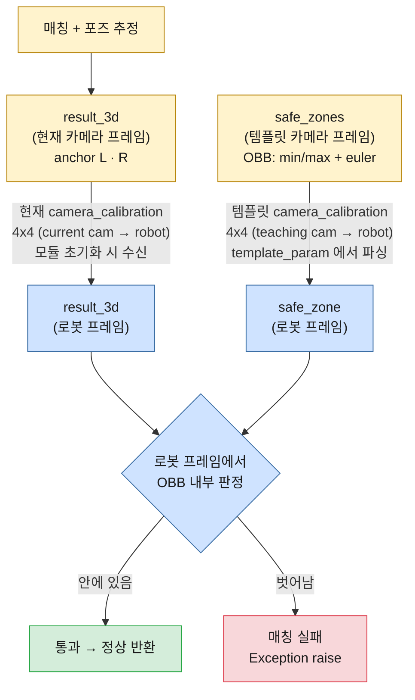

# Safe Zone Check Process

매칭으로 추정한 anchor 포인트가 **유효한 영역(safe zone)** 안에 있는지 검사하는
**안전장치(safety guard)** 입니다.

## 목적

매칭/포즈 추정이 잘못되면 anchor 결과(`result_3d`)가 엉뚱한 위치로 날아갈 수 있습니다.
이를 모르고 로봇이 그 좌표로 이동하면 이상한 곳으로 가서 충돌할 수 있습니다.
Safe zone check는 **포즈가 적용된 최종 anchor 결과가 미리 정의된 유효 영역을
벗어나면 매칭 실패로 처리**하여, 로봇이 비정상 위치로 가는 것을 막습니다.

## 동작 로직

Safe zone은 각 anchor 포인트(`L`, `R`)마다 정의된 **방향이 있는 큐보이드
(OBB, Oriented Bounding Box)** 입니다.

- `min`, `max`: 큐보이드의 두 대각 꼭짓점 `[x, y, z]`
- `euler`: 큐보이드 **중심점 기준 회전** `[rx, ry, rz]` (radian)

판정은 다음과 같이 계산합니다.

```
center  = (min + max) / 2          # 큐보이드 중심
half    = |max - min| / 2          # 각 축 반쪽 크기
R       = euler_to_rotation_matrix(rx, ry, rz)
p_local = Rᵀ · (point - center)    # 포인트를 큐보이드 로컬 좌표계로 변환
safe    = (|p_local.x| ≤ half.x) AND (|p_local.y| ≤ half.y) AND (|p_local.z| ≤ half.z)
```

### 핵심 포인트

- **매칭 transform을 적용하지 않습니다.** Safe zone은 기준 템플릿/월드 좌표
  (고정 카메라 공간)에 고정된 "유효 영역"이고, 포즈가 이미 적용된 `result_3d`를
  **있는 그대로** 그 영역과 비교합니다.
- **검사 대상은 `L`, `R` 두 포인트뿐입니다.** `U` 포인트는 safe zone이 없어 검사하지
  않습니다.
- **하위 호환**: `template_param`에 `safe_zones`가 없으면 검사를 건너뜁니다.

### Euler 회전 규약

`euler`는 **Three.js 의 기본 회전 순서 `'XYZ'`** (프론트엔드에서 safe zone을
생성하는 규약) 와 동일하게 해석합니다.

```
R = Rx · Ry · Rz        (intrinsic XYZ  =  extrinsic ZYX  =  scipy Rotation.from_euler('XYZ'))
```

> 주의: extrinsic XYZ(`Rz · Ry · Rx`)와는 다른 행렬입니다. 구현은 Three.js
> `Matrix4.makeRotationFromEuler('XYZ')` 및 scipy intrinsic `'XYZ'`와 임의 각도에서
> 행렬이 정확히 일치함을 확인했습니다.

## 설정 (template param)

`matcher.teaching.param.yaml` 의 `safe_zones` 섹션에 정의합니다. (최상위 또는
`matching_model` 하위 모두 인식)

```yaml
safe_zones:
  L:
    min: [34.7676, 105.0314, 1552.3996]
    max: [181.7779, -9.7333, 1502.2293]
    euler: [2.7066, 0.5931, -0.1091]
  R:
    min: [514.7950, 295.5452, 1820.6679]
    max: [661.8052, 180.7805, 1770.4976]
    euler: [2.7066, 0.5931, -0.1091]
```

## 결과 (정확한 반환/동작)

검사는 파이프라인에서 3D anchor 결과가 확정된 직후 수행됩니다.

`run_pipeline` 은 **예외를 던지지 않고 항상 `MatchResult`
(`core.matchers.results`) 를 반환**합니다. 호출 측(in-process 백엔드)은 try/except
없이 `success` 로 분기하고, 실패 시 `error_code` 로 원인을 구분합니다.

| 상황 | `Matcher.run_pipeline` 의 반환 (`MatchResult`) |
|------|------|
| 모든 검사 포인트가 zone **안** | `success=True`, `point_l/point_r/point_u/plane_normal` 채워짐. `Safe zone check passed for point L/R.` (DEBUG) |
| 어느 한 포인트라도 zone **밖** | `success=False`, `error_code=SAFE_ZONE_VIOLATION`, `details={"point", "position"}`. 호출 측은 `error_code` 로 분기 처리 |
| `safe_zones` 미설정 | 검사 skip, `success=True` (DEBUG 로그) |

### zone 을 벗어났을 때 (실패)

`check_safe_zones` 는 내부적으로 **`core.matchers.errors.MatcherError`**
(`code = SAFE_ZONE_VIOLATION`) 를 raise 하지만, 이 예외는 `run_pipeline` 경계에서
잡혀 **실패 `MatchResult` 로 변환**되어 반환됩니다. (예외가 외부로 새지 않습니다.)
**`run_pipeline` 은 어떤 경우에도 예외를 던지지 않습니다.**

실패 시 `MatchResult` 필드:

| 필드 | 값 |
|------|-----|
| `res.success` | `False` |
| `res.error_code` | `MatcherErrorCode.SAFE_ZONE_VIOLATION` (문자열 값 `"SAFE_ZONE_VIOLATION"`) |
| `res.error_message` | `point {L\|R} [x, y, z] is outside its safe zone` |
| `res.details` | `{"point": "L"\|"R", "position": [x, y, z]}` (벗어난 포인트와 좌표) |

> 그 외 일반 매칭/깊이 계산 실패는 `error_code=MatcherErrorCode.MATCHING_FAILED` 로
> 반환됩니다.

`run_matcher.py` 처럼 호출 측은 `success` 로 분기하여 아래 한 줄을 ERROR 로 기록합니다.

```
ERROR  ❌ Matching failed - {base_name} [SAFE_ZONE_VIOLATION] point L [150.61, 52.31, 1536.67] is outside its safe zone
```

### 호출 측에서 처리 예시

```python
from core.matchers.results import MatchResult
from core.matchers.errors import MatcherErrorCode

res = matcher.run_pipeline(...)
if not res.success:
    if res.error_code == MatcherErrorCode.SAFE_ZONE_VIOLATION:
        bad_point = res.details["point"]       # "L" 또는 "R"
        position = res.details["position"]      # [x, y, z]
        # 매칭 실패로 처리 (로봇 이동 금지 등)
        ...
    return
# 여기 도달하면 safe zone 통과 (anchor 결과 유효)
use(res.point_l, res.point_r, res.point_u, res.plane_normal)
```

> 에러 코드는 `core/matchers/errors.py` 의 `MatcherErrorCode` 에 정의됩니다. 현재는 safe
> zone 위반(`SAFE_ZONE_VIOLATION`)과 일반 실패(`MATCHING_FAILED`)가 정의되어 있으며,
> 다른 실패 유형도 동일한 스킴으로 코드를 추가할 수 있습니다.

## 구현 위치

- `core/utils/geometry_utils.py`
  - `euler_to_rotation_matrix(rx, ry, rz)` — Three.js XYZ(intrinsic) 회전행렬
  - `is_point_in_safe_zone(point, min, max, euler)` — OBB 내부 판정
- `core/matchers/matcher.py`
  - `Matcher.check_safe_zones(result1_3d, result2_3d)` — L/R 검사, 실패 시 내부적으로 `MatcherError` raise
  - `run_pipeline` 내 anchor 3D 확정 직후 호출. 경계에서 `MatcherError` 를 잡아 실패 `MatchResult` 로 변환 후 반환
- `core/matchers/errors.py`
  - `MatcherErrorCode` (에러 코드 enum), `MatcherError` (내부 전달용 예외, code/message/details 보유)
- `core/matchers/results.py`
  - `MatchResult` (run_pipeline 의 공개 반환 타입, success/point_*/plane_normal/error_code/error_message/details)

## 좌표 프레임 / 설계 근거

Safe zone 검사는 매칭 transform을 적용하지 않고, `result_3d`(카메라 프레임)를
고정된 safe zone과 **카메라 프레임에서 직접 비교**합니다. 근거는 다음과 같습니다.

- 로봇 베이스는 고정(절대 기준)이고, 카메라↔로봇 **hand-eye 캘리브레이션을 알고 있다.**
- 따라서 카메라 프레임은 고정 로봇 프레임과 알려진 고정 변환으로 연결되며, safe zone은
  실질적으로 **"고정 로봇 기준의 절대 안전영역"** 이다.
- 카메라가 움직이면 **재캘리브레이션**으로 카메라↔로봇 관계를 갱신하므로, object별
  transform 보정(transform⁻¹)이나 safe zone 재생성 없이 검사가 유효하다.
- camera↔robot 변환(hand-eye)은 **로봇이 실제로 anchor를 집으러 갈 때(하류)** 적용된다.
  이 모듈의 safe zone 검사 자체는 카메라 프레임 안에서 자기완결적이다.

## 향후 작업 (TODO)

safe zone 검사를 **로봇 프레임**에서 수행하기 위해, 카메라↔로봇 hand-eye 캘리브레이션
(`camera_calibration` 키, **4x4 변환 행렬**)을 두 종류 받아 사용한다. (safe zone 전용)

- [ ] **템플릿(teaching) 카메라 캘리브레이션**: 템플릿과 함께 백엔드가 저장 →
      `template_param`에서 파싱. 템플릿 프레임에 정의된 `safe_zones`를 로봇 프레임으로
      변환하는 데 사용.
- [ ] **현재(runtime) 카메라 캘리브레이션**: 현재 카메라의 hand-eye (동일한 4x4 형식).
      **모듈 초기화 시**(`Matcher` 생성 / `init_config`) 받는다. 현재 카메라 프레임의
      `result_3d`를 로봇 프레임으로 변환하는 데 사용.
- [ ] 위 두 캘리브레이션으로 `result_3d`와 `safe_zones`를 **모두 로봇 프레임으로 모아서**
      비교하도록 `check_safe_zones` 를 변경. (현재는 카메라 프레임 직접 비교)

### 목표 파이프라인 (로봇 프레임 검사)



> **로봇 프레임(고정·절대 기준)** 으로 양쪽을 모은 뒤 OBB 내부를 판정하므로, 카메라가
> 움직여도(→ 재캘리브레이션으로 `camera_calibration` 갱신) 안전영역 검사가 그대로 유효하다.
