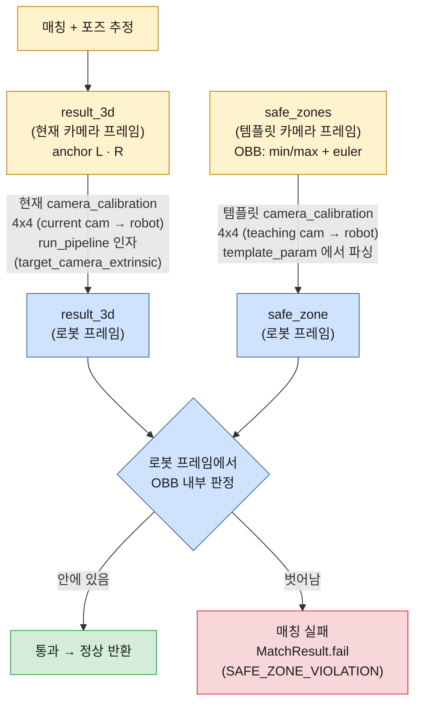

# Safe Zone Check Process

매칭으로 추정한 anchor 포인트가 **유효한 영역(safe zone)** 안에 있는지 검사하는
**안전장치(safety guard)** 입니다.

## 목적

매칭/포즈 추정이 잘못되면 anchor 결과(`result_3d`)가 엉뚱한 위치로 날아갈 수 있습니다.
이를 모르고 로봇이 그 좌표로 이동하면 이상한 곳으로 가서 충돌할 수 있습니다.
Safe zone check는 **포즈가 적용된 최종 anchor 결과가 미리 정의된 유효 영역을
벗어나면 매칭 실패로 처리**하여, 로봇이 비정상 위치로 가는 것을 막습니다.

## 동작 로직

Safe zone은 각 anchor 포인트(`L`, `R`)마다 정의된 **방향이 있는 큐보이드
(OBB, Oriented Bounding Box)** 입니다.

- `min`, `max`: 큐보이드의 두 대각 꼭짓점 `[x, y, z]`
- `euler`: 큐보이드 **중심점 기준 회전** `[rx, ry, rz]` (radian)

판정은 다음과 같이 계산합니다.

```
center  = (min + max) / 2          # 큐보이드 중심
half    = |max - min| / 2          # 각 축 반쪽 크기
R       = euler_to_rotation_matrix(rx, ry, rz)
p_local = Rᵀ · (point - center)    # 포인트를 큐보이드 로컬 좌표계로 변환
safe    = (|p_local.x| ≤ half.x) AND (|p_local.y| ≤ half.y) AND (|p_local.z| ≤ half.z)
```

### 핵심 포인트

- **매칭(포즈) transform을 다시 적용하지 않습니다.** 포즈는 이미 `result_3d`에
  반영돼 있으므로, 그 결과를 safe zone과 **비교만** 합니다. 비교가 이루어지는 좌표
  프레임은 hand-eye 캘리브레이션이 있으면 **로봇 프레임**, 없으면 카메라 프레임입니다
  (아래 ["로봇 프레임 검사"](#로봇-프레임-검사-구현됨) 참고).
- **검사 대상은 `L`, `R` 두 포인트뿐입니다.** `U` 포인트는 safe zone이 없어 검사하지
  않습니다.
- **하위 호환**: `template_param`에 `safe_zones`가 없으면 검사를 건너뜁니다.

### Euler 회전 규약

`euler`는 **Three.js 의 기본 회전 순서 `'XYZ'`** (프론트엔드에서 safe zone을
생성하는 규약) 와 동일하게 해석합니다.

```
R = Rx · Ry · Rz        (intrinsic XYZ  =  extrinsic ZYX  =  scipy Rotation.from_euler('XYZ'))
```

> 주의: extrinsic XYZ(`Rz · Ry · Rx`)와는 다른 행렬입니다. 구현은 Three.js
> `Matrix4.makeRotationFromEuler('XYZ')` 및 scipy intrinsic `'XYZ'`와 임의 각도에서
> 행렬이 정확히 일치함을 확인했습니다.

## 설정 (template param)

`matcher.teaching.param.yaml` 의 `safe_zones` 섹션에 정의합니다. (최상위 또는
`matching_model` 하위 모두 인식)

```yaml
safe_zones:
  L:
    min: [34.7676, 105.0314, 1552.3996]
    max: [181.7779, -9.7333, 1502.2293]
    euler: [2.7066, 0.5931, -0.1091]
  R:
    min: [514.7950, 295.5452, 1820.6679]
    max: [661.8052, 180.7805, 1770.4976]
    euler: [2.7066, 0.5931, -0.1091]

# (선택) hand-eye 캘리브레이션 — 있으면 로봇 프레임에서 검사한다.
# 카메라 -> 로봇(base) 변환 (= inv(T_base2cam)). p_robot = camera_calibration @ p_cam.
# 여기 것은 템플릿(teaching) 카메라 -> 로봇, 4x4 (template_param 에 저장)
camera_calibration:
  - [1.0, 0.0, 0.0, 0.0]
  - [0.0, 1.0, 0.0, 0.0]
  - [0.0, 0.0, 1.0, 0.0]
  - [0.0, 0.0, 0.0, 1.0]
```

현재(매칭/runtime) 카메라 캘리브레이션은 **`run_pipeline(target_camera_extrinsic=...)`
인자**(동일한 4x4 형식)로 매 호출 전달한다. (인자 미전달 시 모듈 config 의
`camera_calibration` 으로 fallback.) 반면 **teaching 캘리브레이션은 `template_param`
에서 `init_config` 시 1회 파싱해 캐싱**한다. teaching/runtime 두 캘리브레이션이 **모두
있을 때만** 로봇 프레임 검사가 활성화되고, 없으면 카메라 프레임에서 직접 비교한다(하위
호환). 4x4 는 중첩 리스트 또는 길이 16 시퀀스 모두 인식.

> **방향 주의**: `camera_calibration` 은 **카메라 → 로봇(base)** 변환이다. 즉
> `T_cam2base = inv(T_base2cam)` 이며, 카메라 좌표 점을 그대로 곱해 로봇 좌표로 보낸다
> (`p_robot = camera_calibration @ p_cam`). 검사 코드는 역행렬을 취하지 않고 그대로 적용한다.

## 결과 (정확한 반환/동작)

검사는 파이프라인에서 3D anchor 결과가 확정된 직후 수행됩니다.

`run_pipeline` 은 **예외를 던지지 않고 항상 `MatchResult`
(`core.matchers.results`) 를 반환**합니다. 호출 측(in-process 백엔드)은 try/except
없이 `success` 로 분기하고, 실패 시 `error_code` 로 원인을 구분합니다.

| 상황 | `Matcher.run_pipeline` 의 반환 (`MatchResult`) |
|------|------|
| 모든 검사 포인트가 zone **안** | `success=True`, `point_l/point_r/point_u/plane_normal` 채워짐. `Safe zone check passed for point L/R.` (DEBUG) |
| 어느 한 포인트라도 zone **밖** | `success=False`, `error_code=SAFE_ZONE_VIOLATION`, `details={"point", "position"}`. 호출 측은 `error_code` 로 분기 처리 |
| `safe_zones` 미설정 | 검사 skip, `success=True` (DEBUG 로그) |

### zone 을 벗어났을 때 (실패)

`check_safe_zones` 는 내부적으로 **`core.matchers.errors.MatcherError`**
(`error_code = ErrorCode.SAFE_ZONE_VIOLATION`) 를 raise 하지만, 이 예외는
`run_pipeline` 경계에서 잡혀 **실패 `MatchResult` 로 변환**되어 반환됩니다. (예외가
외부로 새지 않습니다.) **매칭·depth·safe zone 등 파이프라인 처리 중의 실패는 모두
`MatchResult` 로 반환됩니다.** (단, 잘못된 호출 인자·config 로 인한 초기 설정 단계
오류는 예외가 날 수 있습니다.)

실패 시 `MatchResult` 필드:

| 필드 | 값 |
|------|-----|
| `res.success` | `False` |
| `res.error_code` | `ErrorCode.SAFE_ZONE_VIOLATION` (사내 표준 `ErrorCode`, num=504) |
| `res.error_message` | `point {L\|R} [x, y, z] is outside its safe zone` |
| `res.code` | 숫자 코드 `MMMSEEE` (예: `30504` — MMM=000, S=3, EEE=504) — 로깅/응답용 |
| `res.details` | `{"point": "L"\|"R", "position": [x, y, z]}` (벗어난 포인트와 좌표) |

> 사내 표준 예외가 필요하면 `res.to_error()` 로 `MatchingError` 를 얻을 수 있습니다.
> safe zone 외의 실패도 예외를 던지지 않고 같은 방식으로 실패 `MatchResult` 를
> 반환하되, **종류별로 `ErrorCode` 가 구분**됩니다.
>
> | `error_code` (`ErrorCode`) | num | 의미 |
> |------|------|------|
> | `SAFE_ZONE_VIOLATION` | 504 | anchor 가 safe zone 을 벗어남 (`details={"point","position"}`) |
> | `DEPTH_CALCULATION_FAILED` | 502 | anchor depth 계산 결과가 없음(None) |
> | `DEPTH_OUT_OF_RANGE` | 503 | depth 가 안정 범위를 벗어남 (`details={"point","depth_diff","stable_range"}`) |
> | `MATCH_FAILED` | 401 | 그 외 매칭 실패 (2D/3D 매칭·필터링 등) |

`run_matcher.py` 처럼 호출 측은 `success` 로 분기하여 아래 한 줄을 ERROR 로 기록합니다.

```
ERROR  ❌ Matching failed - {base_name} [30504] SAFE_ZONE_VIOLATION: point L [150.61, 52.31, 1536.67] is outside its safe zone
```

### 호출 측에서 처리 예시

```python
from core.matchers.results import MatchResult
from core.matchers.error_handler import ErrorCode

res = matcher.run_pipeline(...)
if not res.success:
    if res.error_code == ErrorCode.SAFE_ZONE_VIOLATION:
        bad_point = res.details["point"]       # "L" 또는 "R"
        position = res.details["position"]      # [x, y, z]
        # 매칭 실패로 처리 (로봇 이동 금지 등)
        ...
    # 필요하면 사내 표준 예외로: raise res.to_error()
    return
# 여기 도달하면 safe zone 통과 (anchor 결과 유효)
use(res.point_l, res.point_r, res.point_u, res.plane_normal)
```

> 에러 코드는 `core/matchers/error_handler.py` 의 `ErrorCode` (사내 표준) 에
> 정의됩니다. 전체 코드 표·`MMMSEEE` 인코딩은 [Error Codes](error_codes.md) 참고.

## 좌표 프레임 / 설계 근거

safe zone은 결국 "로봇 기준으로 여기 안에 있어야 한다"는 절대 영역입니다. 로봇 베이스는
움직이지 않고, 카메라와 로봇 사이의 hand-eye 관계도 알고 있으니, 카메라에서 본 좌표를
로봇 좌표로 바꿔서 비교하는 게 가장 자연스럽습니다. 그래서 캘리브레이션이 주어지면 로봇
프레임에서 검사합니다.

카메라가 움직이면 hand-eye(`camera_calibration`)만 다시 잡아 주면 됩니다. safe zone을
다시 그리거나 결과에 별도 보정을 넣을 필요 없이, 같은 검사가 그대로 유효합니다.

캘리브레이션이 없을 때는(카메라가 고정이라 teaching과 runtime 프레임이 같다고 보고)
카메라 프레임에서 바로 비교합니다.

## 로봇 프레임 검사 (구현됨)

safe zone 검사를 **로봇 프레임**에서 수행하기 위해, 카메라↔로봇 hand-eye 캘리브레이션
(`camera_calibration` 키, **4x4 변환 행렬**)을 두 종류 받아 사용한다.

- [x] **템플릿(teaching) 카메라 캘리브레이션**: `template_param`(최상위 또는
      `matching_model` 하위)에서 파싱. 템플릿 프레임에 정의된 `safe_zones`를 로봇
      프레임으로 변환하는 데 사용. (`T_teach`)
- [x] **현재(매칭/runtime) 카메라 캘리브레이션**: 동일한 4x4 형식. **`run_pipeline` 의
      `target_camera_extrinsic` 인자**로 매 호출 전달(없으면 config fallback). 현재 카메라
      프레임의 `result_3d`를 로봇 프레임으로 변환하는 데 사용. (`T_runtime`)
- [x] `check_safe_zones` 가 두 캘리브레이션으로 `result_3d`와 `safe_zones`를 **모두
      로봇 프레임으로 모아서** OBB 내부를 판정한다. 두 캘리브레이션이 모두 있을 때만
      활성화되며, 하나라도 없으면 카메라 프레임 직접 비교로 fallback(하위 호환).

  ```
  point_robot = T_runtime · result_3d               # 현재 카메라 -> 로봇
  zone_robot  = transform_safe_zone(zone, T_teach)   # 템플릿 카메라 -> 로봇
                (center' = R_T·center + t_T, R' = R_T·R, half 불변)
  inside      = is_point_in_obb(point_robot, *zone_robot)
  ```

  > 구현: `transform_safe_zone`, `is_point_in_obb`, `transform_point_3d`
  > (`geometry_utils`). 캘리브레이션 파싱은 `Matcher._parse_camera_calibration` /
  > `_safe_zone_calibrations`.

### 파이프라인 (로봇 프레임 검사)



> **로봇 프레임(고정·절대 기준)** 으로 양쪽을 모은 뒤 OBB 내부를 판정하므로, 카메라가
> 움직여도(→ 재캘리브레이션으로 `camera_calibration` 갱신) 안전영역 검사가 그대로 유효하다.
